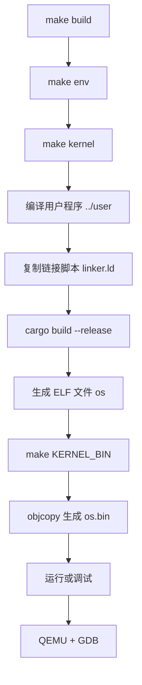

# OS编译

```mermaid
graph TD
    A[make build] --> B[make env]
    B --> C[make kernel]
    C --> D[编译用户程序 ../user]
    D --> E[复制链接脚本 linker.ld]
    E --> F[cargo build --release]
    F --> G[生成 ELF 文件 os]
    G --> H[make KERNEL_BIN]
    H --> I[objcopy 生成 os.bin]
    I --> J[运行或调试]
    J --> K[QEMU + GDB]
```

